# 🔐 FHE Auction Platform

<div align="center">

**Privacy-Preserving Auction Marketplace powered by Zama's Fully Homomorphic Encryption (FHEVM)**

[](https://docs.zama.ai/fhevm)
[](LICENSE)
[](https://docs.soliditylang.org/)
[](https://nextjs.org/)
[](https://thegraph.com/)

[Live Demo](https://your-demo-url.vercel.app) • [Documentation](./DEPLOYMENT_GUIDE.md) • [Report Bug](https://github.com/yourusername/fhe-auction-platform/issues) • [Request Feature](https://github.com/yourusername/fhe-auction-platform/issues)

</div>

---

## 📖 Table of Contents

- [Overview](#-overview)
- [Key Features](#-key-features)
- [Why FHE for Auctions?](#-why-fhe-for-auctions)
- [Architecture](#-architecture)
- [Auction Types](#-auction-types)
- [Technical Deep Dive](#-technical-deep-dive)
- [Quick Start](#-quick-start)
- [Project Structure](#-project-structure)
- [Smart Contracts](#-smart-contracts)
- [Frontend Features](#-frontend-features)
- [The Graph Integration](#-the-graph-integration)
- [Testing](#-testing)
- [Deployment](#-deployment)
- [Security Considerations](#-security-considerations)
- [Roadmap](#-roadmap)
- [Contributing](#-contributing)
- [License](#-license)

---

## 🌟 Overview

The **FHE Auction Platform** is a decentralized auction marketplace where **bids remain encrypted on-chain** using Fully Homomorphic Encryption (FHE). This revolutionary approach ensures that bidders can place sealed bids without revealing their amounts to anyone—not even the auctioneer—until the auction concludes.

### 🎯 What Makes This Special?

- **True Privacy**: Bids are encrypted client-side and remain encrypted on-chain
- **On-Chain Computation**: Winner determined through FHE operations without decryption
- **No Trusted Third Party**: Decentralization without compromising privacy
- **First-Price Sealed-Bid Auctions**: Fully implemented with FHE privacy (Vickrey and Dutch coming soon)
- **NFT Support**: Auction ERC-721 tokens with automatic metadata fetching
- **Production-Ready**: Comprehensive testing, subgraph indexing, and professional UI

---

## ✨ Key Features

### 🔒 Privacy-Preserving Bids

```
Traditional Blockchain Auction:
Alice bids 5 ETH → Everyone sees "5 ETH" → Front-running risk ❌

FHE Auction Platform:
Alice bids 5 ETH → Everyone sees "encrypted_data_xyz" → True privacy ✅
```

- **Client-Side Encryption**: Bids encrypted in browser using Zama FHE SDK
- **On-Chain Privacy**: Encrypted bids stored on blockchain
- **FHE Computations**: Winner determined without decrypting individual bids
- **Secure Reveal**: Only winner and winning bid revealed after auction ends

### 🎯 Auction Types

| Auction Type | Mechanism | Winner Pays | Privacy Level | Status | Use Case |
|--------------|-----------|-------------|---------------|--------|----------|
| **First-Price** | Highest bidder wins | Their own bid | 🔒🔒🔒 Fully encrypted | ✅ **Live** | General auctions, NFTs |
| **Vickrey (Second-Price)** | Highest bidder wins | Second-highest bid | 🔒🔒🔒 Encrypted 1st & 2nd | 🚧 Planned | Encourages truthful bidding |
| **Dutch** | Descending price | Current price | 🔒 Public price | 🚧 Planned | Quick sales, time-sensitive |

> **Note**: Currently, only **First-Price Sealed-Bid Auctions** are fully implemented and live. Vickrey (Second-Price) and Dutch auctions are planned for future releases.

### 🖼️ NFT Auction Support

- **ERC-721 Compatible**: Auction any standard NFT
- **Automatic Metadata**: Fetches name, description, and image from blockchain
- **Secure Escrow**: NFT locked in contract until winner claims
- **Multi-Format Support**: Base64, IPFS, HTTP URIs
- **Fallback Handling**: Graceful degradation for missing metadata

### 🔐 Advanced Privacy Features

#### 1. Private Reserve Price
```solidity
// Seller sets encrypted minimum price
euint32 encryptedReservePrice;
ebool meetsReserve = FHE.gt(winningBid, encryptedReservePrice);
```
- Reserve price stays hidden until reveal
- Auction fails if reserve not met
- Protects seller's minimum valuation

#### 2. Hidden Bidder Count
```solidity
// Number of bidders hidden during auction
uint256 visibleBidderCount = auctionEnded ? bidders.length : 0;
```
- Prevents strategic bidding based on competition
- Revealed only after auction ends
- Maintains auction integrity

#### 3. Encrypted Statistics
```solidity
// Total bid volume computed without revealing individual bids
encryptedTotalBidVolume = FHE.add(encryptedTotalBidVolume, bidAmount);
```
- Aggregate metrics without privacy loss
- Average bid calculation in encrypted form
- Platform analytics with privacy

### 🌐 Full-Stack Implementation

- **Smart Contracts**: Solidity with FHEVM library
- **Frontend**: Next.js 15 with App Router
- **Wallet Integration**: RainbowKit for seamless UX
- **Data Indexing**: The Graph subgraph for fast queries
- **Auction Management**: Manual auction ending (Chainlink Automation integration planned)
- **Deployment**: Sepolia testnet + Vercel hosting

---

## 🤔 Why FHE for Auctions?

### The Problem with Traditional Blockchain Auctions

**Transparency ≠ Privacy**

Blockchain's transparency creates fundamental issues for auctions:

1. **Front-Running**: Bots see your bid and outbid by minimal amounts
2. **Strategic Disadvantage**: Competitors know your maximum willingness to pay
3. **Auction Manipulation**: Sellers can shill bid if they see low bids
4. **Privacy Violation**: Bid amounts reveal financial information

### Traditional Solutions (and Their Limitations)

| Solution | How It Works | Limitations |
|----------|--------------|-------------|
| **Commit-Reveal** | Hash bid, reveal later | Complex, 2-phase process, reveal phase leaks info |
| **Off-Chain Bids** | Centralized server | Requires trust, not verifiable |
| **Zero-Knowledge Proofs** | Prove bid validity without revealing | Limited computations, complex circuits |

### The FHE Advantage

**Fully Homomorphic Encryption** allows computations on encrypted data:

```
Encrypted(5) + Encrypted(3) = Encrypted(8)
Encrypted(10) > Encrypted(7) = Encrypted(true)
```

**Benefits for Auctions:**
- ✅ **True Privacy**: Bids never decrypted during auction
- ✅ **On-Chain Computation**: Winner determined in encrypted form
- ✅ **No Trust Required**: Everything verifiable on blockchain
- ✅ **Single Phase**: No complex commit-reveal schemes
- ✅ **Rich Computations**: Find max, second-max, aggregates, etc.

---

## 🏗️ Architecture

### High-Level System Architecture

```mermaid
graph TB
    subgraph "User Layer"
        User[👤 User]
        Wallet[🦊 MetaMask Wallet]
    end
    
    subgraph "Frontend Layer"
        UI[🎨 Next.js UI]
        FHE_SDK[🔐 FHE SDK]
        Wagmi[⚡ Wagmi/Viem]
        RainbowKit[🌈 RainbowKit]
    end
    
    subgraph "Blockchain Layer - Sepolia"
        Factory[🏭 AuctionFactory]
        FirstPrice[💰 FirstPriceAuction]
        Vickrey[🎯 VickreyAuction]
        Dutch[📉 DutchAuction]
        NFT[🖼️ ERC-721 NFTs]
    end
    
    subgraph "Zama Network"
        Coprocessor[⚙️ FHE Coprocessor]
        Gateway[🚪 Decryption Gateway]
        KMS[🔑 Key Management]
    end
    
    subgraph "Indexing Layer"
        Subgraph[📊 The Graph Subgraph]
        IPFS[📦 IPFS]
    end
    
    User --> Wallet
    Wallet --> UI
    UI --> FHE_SDK
    UI --> Wagmi
    UI --> RainbowKit
    FHE_SDK --> |Encrypt Bids| Wagmi
    Wagmi --> |Transactions| Factory
    
    Factory --> |Deploy| FirstPrice
    
    FirstPrice --> |Escrow| NFT
    
    FirstPrice --> |FHE Operations| Coprocessor
    Coprocessor --> |Decrypt Winner| Gateway
    Gateway --> |Keys| KMS
    
    Factory --> |Events| Subgraph
    FirstPrice --> |Events| Subgraph
    
    Subgraph --> |Fast Queries| UI
    NFT --> |Metadata| IPFS
    
    UI --> |Manual End| FirstPrice
    
    style User fill:#e1f5ff
    style Coprocessor fill:#ffe1e1
    style Gateway fill:#ffe1e1
    style Subgraph fill:#e1ffe1
    style Factory fill:#fff4e1
```



### Auction Lifecycle Flow


### Data Flow Diagram


---

## 🎯 Auction Types

### 1. First-Price Sealed-Bid Auction

**Mechanism**: Highest bidder wins and pays their bid amount.

**How It Works**:
1. Bidders submit encrypted bids with escrow
2. Auction ends after duration expires
3. FHE coprocessor finds maximum encrypted bid
4. Winner revealed through decryption gateway
5. Winner pays their bid, losers get refunds

**Use Cases**:
- General item auctions
- NFT sales
- Real estate
- Art pieces

**Privacy Guarantee**: No one sees any bid until auction ends.

```solidity
// Simplified code example
function endAuction() external {
    euint32 maxBid = bids[0].encryptedAmount;
    uint256 winnerIndex = 0;
    
    for (uint256 i = 1; i < bidders.length; i++) {
        ebool isGreater = FHE.gt(bids[i].encryptedAmount, maxBid);
        maxBid = FHE.select(isGreater, bids[i].encryptedAmount, maxBid);
        winnerIndex = FHE.select(isGreater, i, winnerIndex);
    }
    
    // Request decryption from gateway
    encryptedWinnerIndex = winnerIndex;
    encryptedWinningBid = maxBid;
}
```

### 2. Vickrey (Second-Price) Auction

**Mechanism**: Highest bidder wins but pays the second-highest bid.

**Why Vickrey?**
- **Dominant Strategy**: Bidding your true valuation is optimal
- **Prevents Winner's Curse**: Winner doesn't overpay
- **Economic Efficiency**: Allocates item to highest valuer

**How It Works**:
1. Bidders submit encrypted bids
2. FHE finds both highest and second-highest bids
3. Winner pays second-highest amount
4. Encourages truthful bidding

**Use Cases**:
- Government spectrum auctions
- Advertising slots
- Resource allocation
- Academic research

**Privacy Guarantee**: Both first and second prices remain encrypted until reveal.

```solidity
// Track both first and second prices
euint32 maxBid;
euint32 secondMaxBid;

// Update logic maintains both encrypted values
ebool isGreater = FHE.gt(currentBid, maxBid);
secondMaxBid = FHE.select(isGreater, maxBid, secondMaxBid);
maxBid = FHE.select(isGreater, currentBid, maxBid);
```

### 3. Dutch Auction

**Mechanism**: Price starts high and decreases over time. First bidder wins at current price.

**How It Works**:
1. Auction starts at high price
2. Price decreases linearly over time
3. First bidder accepts current price
4. Instant settlement, no waiting

**Use Cases**:
- Flower markets (original use case!)
- IPO share offerings
- Liquidation sales
- Time-sensitive items

**Privacy Note**: Price is public (descending), but no FHE needed. Instant settlement.

```solidity
function getCurrentPrice() public view returns (uint256) {
    if (block.timestamp >= auctionEndTime) return reservePrice;
    
    uint256 elapsed = block.timestamp - auctionStartTime;
    uint256 totalDuration = auctionEndTime - auctionStartTime;
    uint256 priceRange = startingPrice - reservePrice;
    
    return startingPrice - (priceRange * elapsed / totalDuration);
}
```

---

## 🔬 Technical Deep Dive

### FHE Implementation Details

#### 1. Encrypted Bid Storage

```solidity
struct Bid {
    euint32 encryptedAmount;  // FHE encrypted bid value
    uint256 escrowAmount;     // Public ETH deposit (for refunds)
    bool exists;              // Bid existence flag
}

mapping(address => Bid) public bids;
address[] public bidders;
```

**Why separate encrypted and escrow amounts?**
- `encryptedAmount`: Actual bid (private, used for winner determination)
- `escrowAmount`: Public deposit (for refund calculations)
- Allows refunds without decrypting losing bids

#### 2. FHE Operations Used

| Operation | Solidity Code | Purpose |
|-----------|---------------|---------|
| **Comparison** | `FHE.gt(a, b)` | Find maximum bid |
| **Selection** | `FHE.select(condition, a, b)` | Choose winner based on encrypted comparison |
| **Addition** | `FHE.add(a, b)` | Aggregate bid volumes |
| **Encryption** | `FHE.fromExternal(external, proof)` | Import client-encrypted values |
| **Decryption Request** | `Gateway.requestDecryption(encrypted)` | Reveal winner after auction |

#### 3. Zero-Knowledge Proofs

Every encrypted bid includes a ZK proof:

```typescript
// Frontend: Generate proof
const input = await instance.createEncryptedInput(auctionAddress);
input.add32(bidAmount);
const { handles, inputProof } = await input.encrypt();

// Smart Contract: Verify proof
euint32 bid = FHE.fromExternal(encryptedBid, inputProof);
```

**Proof ensures**:
- Bid was encrypted correctly
- Bidder knows the plaintext value
- No malicious encrypted data

#### 4. Decryption Gateway Flow


### Smart Contract Architecture

#### Inheritance Hierarchy


#### Key Contract Functions

**AuctionFactory.sol**
```solidity
// Submit auction request
function submitAuctionRequest(
    string calldata _title,
    string calldata _description,
    uint256 _durationMinutes,
    uint256 _minimumBid,
    address _nftContract,
    uint256 _nftTokenId
) external returns (uint256 requestId);

// Admin approves and deploys auction
function registerAuction(
    uint256 requestId,
    address auctionAddress
) external onlyAdmin;

// Chainlink automation
function checkUpkeep(bytes calldata)
    external view returns (bool upkeepNeeded, bytes memory performData);

function performUpkeep(bytes calldata performData) external;
```

**BaseAuction.sol**
```solidity
// Place encrypted bid
function placeBid(
    externalEuint32 encryptedBid,
    bytes calldata inputProof
) external payable auctionActive;

// Set private reserve price
function setReservePrice(
    externalEuint32 encryptedReserve,
    bytes calldata inputProof
) external onlySeller;

// Claim refund (losers)
function claimRefund() external;

// Claim prize (winner)
function claimPrize() external;
```

### Frontend Architecture

#### Tech Stack

- **Framework**: Next.js 15 (App Router)
- **Styling**: Tailwind CSS
- **Blockchain**: Wagmi v2 + Viem
- **Wallet**: RainbowKit
- **FHE**: Zama Relayer SDK (CDN)
- **Data**: The Graph (GraphQL)
- **State**: React hooks + Context

#### FHE SDK Integration

```typescript
// lib/fhevm.ts
import { createInstance } from '@zama-fhe/relayer-sdk';

let fhevmInstance: FhevmInstance | null = null;

export async function initializeFHE(): Promise<void> {
  if (fhevmInstance) return;
  
  const publicKey = await getPublicKey();
  
  fhevmInstance = await createInstance({
    chainId: 11155111, // Sepolia
    publicKey,
    gatewayUrl: 'https://gateway.zama.ai',
  });
}

export async function encryptBid(amount: number): Promise<string> {
  if (!fhevmInstance) throw new Error('FHE not initialized');
  
  const encrypted = fhevmInstance.encrypt32(amount);
  return encrypted;
}
```

#### Component Structure

```
app/
├── page.tsx                 # Homepage with auction carousel
├── layout.tsx               # Root layout with providers
├── providers.tsx            # Wagmi + RainbowKit setup
├── auction/
│   ├── create/
│   │   └── page.tsx         # Create auction form
│   └── [id]/
│       └── page.tsx         # Auction detail + bidding
├── auctions/
│   └── page.tsx             # Browse all auctions
├── admin/
│   └── page.tsx             # Admin dashboard
├── dashboard/
│   └── page.tsx             # User dashboard
├── bids/
│   └── page.tsx             # User's bids
├── statistics/
│   └── page.tsx             # Platform statistics
└── docs/
    └── page.tsx             # Documentation
```

---

## 🚀 Quick Start

### Prerequisites

| Requirement | Version | Installation |
|-------------|---------|--------------|
| Node.js | ≥ 20.0.0 | [Download](https://nodejs.org/) |
| npm | ≥ 7.0.0 | Comes with Node.js |
| Git | Latest | [Download](https://git-scm.com/) |
| MetaMask | Latest | [Browser Extension](https://metamask.io/) |

### Installation

```bash
# 1. Clone the repository
git clone https://github.com/yourusername/fhe-auction-platform.git
cd fhe-auction-platform

# 2. Install root dependencies
npm install

# 3. Install frontend dependencies
cd frontend-next
npm install
cd ..

# 4. Configure environment variables
npx hardhat vars set MNEMONIC
npx hardhat vars set INFURA_API_KEY
npx hardhat vars set ETHERSCAN_API_KEY
```

### Local Development

```bash
# Terminal 1: Start local Hardhat node (optional)
npm run chain

# Terminal 2: Deploy contracts to Sepolia
npx hardhat run scripts/deploy-factory.ts --network sepolia

# Terminal 3: Start frontend
cd frontend-next
cp .env.local.example .env.local
# Edit .env.local with your deployed contract address
npm run dev
```

Open [http://localhost:3000](http://localhost:3000) in your browser.

### Running Tests

```bash
# Run all tests (85 tests)
npm run test

# Run with gas reporting
REPORT_GAS=true npm run test

# Run specific test file
npx hardhat test test/FirstPriceAuction.test.ts

# Generate coverage report
npm run coverage
```

---

## 📁 Project Structure

```
fhe-auction-platform/
├── contracts/                      # Solidity smart contracts
│   ├── AuctionFactory.sol          # Factory 
│   ├── BaseAuction.sol             # Abstract base with FHE logic
│   └── FirstPriceAuction.sol       # First-price implementation
│
├── test/                           # Comprehensive test suite (85 tests)
│   ├── helpers.ts                  # Test utilities and fixtures
│   ├── AuctionFactory.test.ts      # Factory tests (45 tests)
│   └── FirstPriceAuction.test.ts   # First-price tests (40 tests)
│
├── frontend-next/                  # Next.js frontend
│   ├── app/                        # App router pages
│   │   ├── page.tsx                # Homepage
│   │   ├── auction/[id]/           # Auction detail
│   │   ├── auctions/               # Browse auctions
│   │   ├── admin/                  # Admin dashboard
│   │   ├── dashboard/              # User dashboard
│   │   ├── bids/                   # User bids
│   │   ├── statistics/             # Platform stats
│   │   └── docs/                   # Documentation
│   ├── components/                 # React components
│   │   └── ui/                     # UI components
│   ├── lib/                        # Utility libraries
│   │   ├── fhevm.ts                # FHE SDK integration
│   │   ├── wagmi.ts                # Wagmi configuration
│   │   ├── subgraph.ts             # The Graph queries
│   │   ├── nftUtils.ts             # NFT metadata fetching
│   │   └── contracts/              # Contract interactions
│   └── public/                     # Static assets
│
├── subgraph/                       # The Graph subgraph
│   ├── schema.graphql              # GraphQL schema
│   ├── subgraph.yaml               # Subgraph manifest
│   └── src/
│       └── mapping.ts              # Event handlers
│
├── scripts/                        # Deployment scripts
│   ├── deploy-factory.ts           # Deploy AuctionFactory
│   └── deploy-auction.ts           # Deploy individual auctions
│
├── tasks/                          # Hardhat tasks
│   └── accounts.ts                 # Account management
│
├── hardhat.config.ts               # Hardhat configuration
├── package.json                    # Project dependencies
├── DEPLOYMENT_GUIDE.md             # Deployment instructions
└── README.md                       # This file
```

---

## 🔧 Smart Contracts

### Contract Overview

| Contract | Size | Lines | Purpose |
|----------|------|-------|---------|
| `AuctionFactory.sol` | 12.9 KB | 367 | Factory pattern |
| `BaseAuction.sol` | 24.2 KB | 686 | Abstract base with FHE operations |
| `FirstPriceAuction.sol` | 7.7 KB | 220 | First-price sealed-bid implementation |

### AuctionFactory

**Purpose**: Central factory for creating and managing auctions.

**Key Features**:
- Request-based auction creation
- Admin approval workflow
- Auction registry and tracking

**Main Functions**:
```solidity
// Submit auction request
function submitAuctionRequest(...) external returns (uint256 requestId);

// Admin registers deployed auction
function registerAuction(uint256 requestId, address auction) external onlyAdmin;

// Get all active auctions
function getActiveAuctions() external view returns (address[] memory);

// Chainlink automation
function checkUpkeep(...) external view returns (bool, bytes memory);
function performUpkeep(bytes calldata) external;
```

### BaseAuction

**Purpose**: Abstract base providing shared auction functionality.

**Key Features**:
- Encrypted bid storage and management
- NFT escrow mechanism
- Refund system for losers
- Privacy features (reserve price, hidden count)
- Winner reveal mechanism

**Privacy Features**:
```solidity
// Private reserve price
euint32 internal encryptedReservePrice;
bool public hasReservePrice;

// Hidden bidder count
function getAuctionState() external view returns (...) {
    uint256 visibleBidderCount = auctionEnded ? bidders.length : 0;
    // ...
}

// Encrypted statistics
euint32 internal encryptedTotalBidVolume;
```

### Gas Costs

Approximate gas costs on Sepolia:

| Operation | Gas Cost | USD (@ $2000 ETH, 20 gwei) |
|-----------|----------|----------------------------|
| Deploy Factory | ~2,500,000 | ~$0.10 |
| Deploy Auction | ~3,000,000 | ~$0.12 |
| Place Bid (FHE) | ~500,000 | ~$0.02 |
| End Auction | ~300,000 | ~$0.012 |
| Reveal Winner | ~200,000 | ~$0.008 |
| Claim Refund | ~50,000 | ~$0.002 |

*Note: FHE operations are more expensive than regular operations but provide unmatched privacy.*

---

## 🖥️ Frontend Features

### User Interface

#### Homepage
- **Live Auction Carousel**: Infinite scroll of active auctions
- **Featured Auctions**: Highlighted NFT auctions
- **Quick Stats**: Total auctions, active bids, platform volume
- **Search & Filter**: Find auctions by type, status, or keyword

#### Auction Detail Page
- **Auction Information**: Title, description, seller, end time
- **NFT Display**: Automatic metadata fetching and rendering
- **Bid Form**: Encrypted bid placement with FHE
- **Bid History**: Number of bids (hidden until end)
- **Countdown Timer**: Real-time auction countdown

#### Admin Dashboard
- **Pending Requests**: View all auction requests
- **Approval Workflow**: Approve/reject with one click
- **Direct Deployment**: Deploy auction contracts from browser
- **Platform Stats**: Monitor platform health

#### User Dashboard
- **My Auctions**: Auctions you created
- **My Bids**: Active and past bids
- **Winnings**: Auctions you won
- **Refunds**: Claimable refunds from lost auctions

#### Statistics Page
- **Platform Metrics**: Total auctions, bids, users
- **Charts**: Activity over time
- **Auction Types**: Distribution of auction types
- **Top Sellers**: Leaderboard

### Wallet Integration

**RainbowKit** provides:
- Multiple wallet support (MetaMask, WalletConnect, Coinbase, etc.)
- Automatic network switching to Sepolia
- Transaction history
- ENS name resolution
- Beautiful, customizable UI

```typescript
// Wagmi configuration
const config = createConfig({
  chains: [sepolia],
  transports: {
    [sepolia.id]: http(),
  },
  connectors: [
    injectedConnector(),
    walletConnectConnector({ projectId }),
    coinbaseConnector(),
  ],
});
```

### NFT Metadata Fetching

Automatically fetches and displays NFT metadata:

```typescript
// lib/nftUtils.ts
export async function fetchNFTMetadata(
  contractAddress: string,
  tokenId: string
): Promise<NFTMetadata> {
  const contract = new Contract(contractAddress, ERC721_ABI, provider);
  
  // Get token URI
  const tokenURI = await contract.tokenURI(tokenId);
  
  // Handle different URI formats
  if (tokenURI.startsWith('data:application/json;base64,')) {
    // Base64 encoded
    return parseBase64Metadata(tokenURI);
  } else if (tokenURI.startsWith('ipfs://')) {
    // IPFS
    return fetchFromIPFS(tokenURI);
  } else {
    // HTTP
    return fetchFromHTTP(tokenURI);
  }
}
```

**Supported Formats**:
- ✅ Base64 encoded JSON
- ✅ IPFS URIs (`ipfs://...`)
- ✅ HTTP/HTTPS URLs
- ✅ Embedded SVG data
- ✅ Fallback placeholders

---

## 📊 The Graph Integration

### Why The Graph?

**Problem**: Querying blockchain data via RPC is slow and expensive.

**Solution**: The Graph indexes blockchain events into a queryable database.

**Benefits**:
- ⚡ **Fast Queries**: Milliseconds vs. seconds
- 💰 **Cost Effective**: No RPC rate limits
- 🔍 **Complex Queries**: Filter, sort, paginate
- 📈 **Historical Data**: Track changes over time

### Subgraph Schema

```graphql
type Auction @entity {
  id: ID!                          # Auction address
  auctionId: BigInt!               # Factory request ID
  seller: Bytes!                   # Seller address
  title: String!                   # Auction title
  auctionType: String!             # "FirstPrice", "Vickrey", "Dutch"
  minimumBid: BigInt!              # Minimum bid in wei
  startTime: BigInt!               # Start timestamp
  endTime: BigInt!                 # End timestamp
  ended: Boolean!                  # Auction ended flag
  bidCount: Int!                   # Number of bids
  winner: Bytes                    # Winner address (after reveal)
  winningBid: BigInt               # Winning bid amount (after reveal)
  nftContract: Bytes               # NFT contract address
  nftTokenId: BigInt               # NFT token ID
  bids: [Bid!]! @derivedFrom(field: "auction")
}

type Bid @entity {
  id: ID!                          # tx hash + log index
  auction: Auction!                # Auction reference
  bidder: Bytes!                   # Bidder address
  escrowAmount: BigInt!            # Public escrow amount
  timestamp: BigInt!               # Bid timestamp
  blockNumber: BigInt!             # Block number
}

type User @entity {
  id: ID!                          # User address
  totalAuctionsCreated: Int!       # Auctions created count
  totalBids: Int!                  # Bids placed count
  auctionsCreated: [Auction!]! @derivedFrom(field: "seller")
  bids: [Bid!]! @derivedFrom(field: "bidder")
}

type GlobalStats @entity {
  id: ID!                          # "global"
  totalAuctions: Int!              # Total auctions created
  activeAuctions: Int!             # Currently active auctions
  endedAuctions: Int!              # Ended auctions
  totalBids: Int!                  # Total bids placed
  totalUsers: Int!                 # Unique users
}
```

### Example Queries

**Get Active Auctions**:
```graphql
{
  auctions(
    where: { ended: false }
    first: 10
    orderBy: endTime
    orderDirection: asc
  ) {
    id
    title
    seller
    auctionType
    minimumBid
    endTime
    bidCount
  }
}
```

**Get User Dashboard**:
```graphql
{
  user(id: "0x...") {
    totalAuctionsCreated
    totalBids
    auctionsCreated(first: 10) {
      id
      title
      ended
      bidCount
    }
    bids(first: 10, orderBy: timestamp, orderDirection: desc) {
      auction {
        title
      }
      escrowAmount
      timestamp
    }
  }
}
```

**Get Platform Statistics**:
```graphql
{
  globalStats(id: "global") {
    totalAuctions
    activeAuctions
    endedAuctions
    totalBids
    totalUsers
  }
}
```

### Deployment

```bash
cd subgraph

# Install dependencies
npm install

# Authenticate with The Graph Studio
npx graph auth --studio YOUR_DEPLOY_KEY

# Generate types from schema
npm run codegen

# Build subgraph
npm run build

# Deploy to The Graph Studio
npm run deploy
```

**Deployed Subgraph**: [View on The Graph Studio](https://thegraph.com/studio/)

---

## 🧪 Testing

### Test Coverage

Comprehensive test suite with **85 passing tests**:

| Test File | Tests | Coverage | Status |
|----------|-------|----------|--------|
| AuctionFactory.test.ts | 45 | 95%+ | ✅ All pass |
| FirstPriceAuction.test.ts | 40 | 95%+ | ✅ All pass |
| helpers.ts | - | - | ✅ Test utilities |
| **Total** | **85** | **95%+** | ✅ **All pass** |

> **Note**: Test suite focuses on First-Price auctions. Additional tests for Vickrey and Dutch auctions will be added when those auction types are implemented.

### Test Categories

**Unit Tests**:
- ✅ Auction creation and approval
- ✅ Encrypted bid placement
- ✅ FHE operations (comparison, selection)
- ✅ Winner determination
- ✅ Refund mechanism
- ✅ NFT escrow and transfer
- ✅ Privacy features (reserve price, hidden count)

**Integration Tests**:
- ✅ Factory → Auction deployment
- ✅ Multiple bidders scenario
- ✅ End-to-end auction flow

**Edge Cases**:
- ✅ No bids placed
- ✅ Single bidder
- ✅ Tie bids
- ✅ Reserve price not met
- ✅ Auction expiration
- ✅ Invalid inputs

### Running Tests

```bash
# Run all tests
npm run test

# Run with gas reporting
REPORT_GAS=true npm run test

# Run specific test file
npx hardhat test test/FirstPriceAuction.test.ts

# Run with coverage
npm run coverage

# Run in watch mode (development)
npx hardhat watch test
```

### Example Test

```typescript
describe("FirstPriceAuction - Encrypted Bidding", function () {
  it("Should accept encrypted bids and determine winner", async function () {
    const { auction, alice, bob } = await loadFixture(deployAuctionFixture);
    
    // Alice bids 5 ETH (encrypted)
    const aliceBid = await encryptBid(5);
    await auction.connect(alice).placeBid(aliceBid.encrypted, aliceBid.proof, {
      value: ethers.parseEther("5")
    });
    
    // Bob bids 7 ETH (encrypted)
    const bobBid = await encryptBid(7);
    await auction.connect(bob).placeBid(bobBid.encrypted, bobBid.proof, {
      value: ethers.parseEther("7")
    });
    
    // End auction
    await time.increase(3600); // 1 hour
    await auction.endAuction();
    
    // Reveal winner (Bob should win with 7 ETH)
    await auction.revealWinner(1, ethers.parseEther("7"), "0x");
    
    expect(await auction.winner()).to.equal(bob.address);
    expect(await auction.revealedWinningBid()).to.equal(ethers.parseEther("7"));
  });
});
```

---

## 🚢 Deployment

### Deployed Contracts (Sepolia Testnet)

| Contract | Address | Etherscan |
|----------|---------|-----------|
| **AuctionFactory** | `0x843D293BB45dF038C0Cb712156D72085C422F42e` | [View](https://sepolia.etherscan.io/address/0x843D293BB45dF038C0Cb712156D72085C422F42e) |

### Deployment Guide

See [DEPLOYMENT_GUIDE.md](./DEPLOYMENT_GUIDE.md) for detailed instructions.

**Quick Deploy**:

```bash
# 1. Compile contracts
npm run compile

# 2. Deploy to Sepolia
npx hardhat run scripts/deploy-factory.ts --network sepolia

# 3. Verify on Etherscan
npx hardhat verify --network sepolia <FACTORY_ADDRESS>

# 4. Deploy frontend to Vercel
cd frontend-next
vercel --prod
```

### Environment Variables

**Smart Contracts** (Hardhat vars):
```bash
npx hardhat vars set MNEMONIC "your twelve word seed phrase"
npx hardhat vars set INFURA_API_KEY "your_infura_key"
npx hardhat vars set ETHERSCAN_API_KEY "your_etherscan_key"
```

**Frontend** (`.env.local`):
```env
NEXT_PUBLIC_WALLETCONNECT_PROJECT_ID=your_project_id
NEXT_PUBLIC_FACTORY_ADDRESS=0x843D293BB45dF038C0Cb712156D72085C422F42e
NEXT_PUBLIC_SUBGRAPH_URL=https://api.studio.thegraph.com/query/.../fhe-auction/version/latest
```

---

## 🔒 Security Considerations

### Smart Contract Security

✅ **Implemented**:
- Reentrancy guards on all state-changing functions
- Access control (onlyAdmin, onlySeller, onlyFactory)
- Input validation and bounds checking
- Safe math operations (Solidity 0.8+)
- Pull payment pattern for refunds
- NFT escrow mechanism

⚠️ **Considerations**:
- FHE operations are computationally expensive (gas costs)
- Decryption gateway is a trusted component (Zama network)
- Admin has privileged access (consider multi-sig)

### Privacy Guarantees

**What's Private**:
- ✅ Bid amounts during auction
- ✅ Reserve price (if set)
- ✅ Bidder count during auction
- ✅ Total bid volume (until revealed)

**What's Public**:
- ⚠️ Bidder addresses (on-chain)
- ⚠️ Escrow amounts (for refunds)
- ⚠️ Winner and winning bid (after reveal)
- ⚠️ Auction metadata (title, duration, etc.)

### Audit Status

🔍 **Not yet audited** - This is a demonstration project.

**For production use**:
- Conduct professional smart contract audit
- Implement formal verification
- Bug bounty program
- Multi-sig admin controls
- Gradual rollout with limits

---

## 🗺️ Roadmap

### Phase 1: Core Platform ✅ (Completed)
- [x] Smart contract development
- [x] FHE integration
- [x] Frontend implementation
- [x] The Graph subgraph
- [x] Sepolia deployment
- [x] Comprehensive testing

### Phase 2: Enhanced Features 🚧 (In Progress)
- [ ] Mobile-responsive design improvements
- [ ] Advanced search and filtering
- [ ] Auction categories and tags
- [ ] User profiles and reputation
- [ ] Email notifications
- [ ] Auction templates

### Phase 3: Scalability 📅 (Planned)
- [ ] Layer 2 deployment (Arbitrum, Optimism)
- [ ] Gas optimization
- [ ] Batch auction creation
- [ ] Multi-currency support (ERC-20 bids)
- [ ] Cross-chain NFT support

### Phase 4: Advanced Auctions 🔮 (Future)
- [ ] Multi-item auctions
- [ ] Combinatorial auctions
- [ ] Candle auctions
- [ ] Reverse auctions (procurement)
- [ ] Auction bundles

### Phase 5: Ecosystem 🌐 (Vision)
- [ ] Mainnet deployment
- [ ] DAO governance
- [ ] Platform token
- [ ] Staking and rewards
- [ ] API for third-party integrations
- [ ] White-label solution

---

## 📋 Available Scripts

| Script | Description |
|--------|-------------|
| `npm run compile` | Compile all smart contracts |
| `npm run test` | Run all tests (108 tests) |
| `npm run coverage` | Generate test coverage report |
| `npm run chain` | Start local Hardhat node |
| `npm run deploy:localhost` | Deploy to local network |
| `npm run deploy:sepolia` | Deploy to Sepolia testnet |
| `npm run verify:sepolia` | Verify contracts on Etherscan |
| `npm run clean` | Clean artifacts and cache |

**Frontend Scripts** (in `frontend-next/`):
| Script | Description |
|--------|-------------|
| `npm run dev` | Start development server |
| `npm run build` | Build for production |
| `npm start` | Start production server |
| `npm run lint` | Run ESLint |

**Subgraph Scripts** (in `subgraph/`):
| Script | Description |
|--------|-------------|
| `npm run codegen` | Generate types from schema |
| `npm run build` | Build subgraph |
| `npm run deploy` | Deploy to The Graph Studio |

---

## 🤝 Contributing

Contributions are welcome! Please follow these guidelines:

### How to Contribute

1. **Fork the repository**
2. **Create a feature branch**
   ```bash
   git checkout -b feature/amazing-feature
   ```
3. **Make your changes**
   - Follow existing code style
   - Add tests for new features
   - Update documentation
4. **Commit your changes**
   ```bash
   git commit -m 'Add amazing feature'
   ```
5. **Push to your fork**
   ```bash
   git push origin feature/amazing-feature
   ```
6. **Open a Pull Request**

### Development Guidelines

- **Code Style**: Follow existing patterns
- **Testing**: All new features must have tests
- **Documentation**: Update README and inline comments
- **Commits**: Use clear, descriptive commit messages
- **PRs**: Provide detailed description of changes

### Areas for Contribution

- 🐛 Bug fixes
- ✨ New auction types
- 🎨 UI/UX improvements
- 📝 Documentation
- 🧪 Additional tests
- ⚡ Gas optimizations
- 🌐 Internationalization

---

## 📚 Resources

### Official Documentation
- [Zama FHEVM Docs](https://docs.zama.ai/fhevm) - Fully Homomorphic Encryption
- [The Graph Docs](https://thegraph.com/docs/) - Blockchain indexing
- [Hardhat Docs](https://hardhat.org/docs) - Development environment
- [Next.js Docs](https://nextjs.org/docs) - React framework
- [RainbowKit Docs](https://www.rainbowkit.com/docs) - Wallet integration

### Related Projects
- [Zama GitHub](https://github.com/zama-ai/fhevm) - FHEVM Solidity library
- [FHEVM Examples](https://github.com/zama-ai/fhevm-contracts) - Example contracts
- [Chainlink Automation](https://docs.chain.link/chainlink-automation) - Automated contract execution

### Learning Resources
- [FHE Explained](https://www.zama.ai/post/what-is-fully-homomorphic-encryption-fhe) - Introduction to FHE
- [Auction Theory](https://en.wikipedia.org/wiki/Auction_theory) - Economic foundations
- [Vickrey Auction](https://en.wikipedia.org/wiki/Vickrey_auction) - Second-price mechanism

---

## 📄 License

This project is licensed under the **BSD-3-Clause-Clear License**.

See the [LICENSE](LICENSE) file for details.

**Key Points**:
- ✅ Commercial use allowed
- ✅ Modification allowed
- ✅ Distribution allowed
- ⚠️ No patent grant
- ⚠️ No warranty

---

## 🙏 Acknowledgments

- **[Zama](https://www.zama.ai/)** - For the groundbreaking FHEVM technology
- **[The Graph](https://thegraph.com/)** - For efficient blockchain indexing
- **[Hardhat](https://hardhat.org/)** - For the excellent development environment
- **[OpenZeppelin](https://www.openzeppelin.com/)** - For security best practices
- **[RainbowKit](https://www.rainbowkit.com/)** - For beautiful wallet UX
- **[Chainlink](https://chain.link/)** - For reliable automation

---

## 📞 Contact & Support

- **GitHub Issues**: [Report bugs or request features](https://github.com/yourusername/fhe-auction-platform/issues)
- **Discussions**: [Join the conversation](https://github.com/yourusername/fhe-auction-platform/discussions)
- **Twitter**: [@yourhandle](https://twitter.com/yourhandle)
- **Email**: your.email@example.com

---

## ⭐ Star History

If you find this project useful, please consider giving it a star! ⭐

[](https://star-history.com/#yourusername/fhe-auction-platform&Date)

---

<div align="center">

**Built with ❤️ for the Zama Developer Program**

[⬆ Back to Top](#-fhe-auction-platform)

</div>
